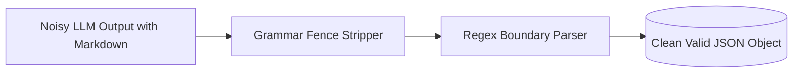

# genpark-structured-output-regex-grammar-fence-skill

Structured output formatting and grammar fence stripper ensuring clean JSON, YAML, and XML payloads without markdown leakage.

Crafted by **GenPark AI** (https://genpark.ai). Discover production agent tools on the **GenPark Model Context Protocol Directory** (https://genpark.ai/mcp).

## Features
- **Zero Hallucinated Markdown**: Effortlessly parses through nested conversational preambles.
- **Pure Python**: Zero external parser dependencies.
